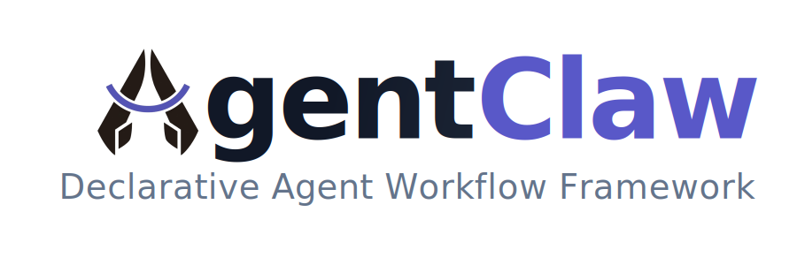

# AgentClaw

<p align="center">
  
</p>

<p align="center">
  <strong>Declarative Agent Workflow Framework</strong><br>
  <em>For individual developers and teams, build, debug, deploy, and continuously strengthen your own Claw capabilities</em>
</p>

<p align="center">
  <a href="./README_CN.md">中文文档</a> •
  <a href="#-product-preview">Product Preview</a> •
  <a href="#-from-idea-to-launch">From Idea to Launch</a> •
  <a href="#-comparison-at-a-glance">Comparison at a Glance</a> •
  <a href="#-quick-start">Quick Start</a> •
  <a href="#-commercial--enterprise-support">Commercial Support</a> •
  <a href="./agentclaw/docs/en/user_guide.md">Documentation</a>
</p>

<p align="center">
  
  
  
</p>

---

## 🎬 Product Preview

### Agent Creator Demo: Build a Scheduled System-Log Audit Agent

This demo shows Agent Creator turning a natural-language request into a working system-log audit agent: it connects to MySQL, reads `system_audit_logs`, analyzes errors, warnings, abnormal access, permission denials, high-risk operations, and scheduled-job execution, creates a daily scheduler job, runs the agent, and writes a Markdown report.

<p align="center">
  <a href="./assets/agent_creator.gif">
    
  </a>
</p>

<p align="center">
  <a href="./assets/agent_creator.gif">Open the Agent Creator demo GIF</a>
</p>

## Core Value

AgentClaw is a Harness-based declarative Agent framework for individual developers and teams, and also a continuously evolving Claw foundation: you can generate an agent from a single sentence and keep turning what you build into your own Claw capabilities.

It follows a convention-over-configuration design, pulling repetitive agent engineering work into the framework; compared with building agents from scratch, it typically saves about 90% of the work in common scenarios.

In practice, you can use AgentClaw both as a Claw for daily work and as the foundation for continuously building, debugging, deploying, and compounding capabilities. Its current core capabilities include:

| Capability Area | What it can do today |
|------|------|
| Agent framework | Declarative workflows, node and router orchestration, agentic LLM nodes, custom nodes and tools |
| Claw execution | Operate the computer, operate the browser, read and write code, handle files, call tools |
| Knowledge | Knowledge base import, document parsing, retrieval augmentation, knowledge injection |
| Memory | Global memory, long-term context accumulation, multi-turn continuity, context compression |
| Integration | Skills, MCP, external tool integration, channel adapters |
| Runtime | Scheduled jobs, frontend and Dashboard, state persistence, hot prompt updates |
| Operations | Conversation management, message feedback, execution tracing, log stats, token stats, channel push |
| Delivery | Publish as APIs, MCP servers, or internal AgentClaw building blocks |

Anything you build in AgentClaw, whether it is an agent, tool, Skill, or MCP integration, is not just a one-off workflow. It becomes a reusable and continuously improvable capability inside your Claw.

A typical path from one sentence to published capability looks like this:

One-sentence request / `claw agent` -> generate an agent -> refine the workflow -> connect tools and knowledge -> debug and test -> deploy -> publish as API / MCP / AgentClaw built-in capability

Declarative workflows are the core of this capability-growth loop: you can describe agent behavior like building blocks, while still retaining room for deeper engineering control when needed.

## 🚀 Quick Start

### 1. Install

```bash
pip install agentclaw-ai
```

If you use `uv`, install the same PyPI package with:

```bash
uv pip install agentclaw-ai
```

The PyPI distribution is `agentclaw-ai`; the Python import package and CLI remain `agentclaw`.

### 2. Start AgentClaw

```bash
agentclaw up
```

`agentclaw up` is the recommended startup path. It opens an interactive wizard
where you choose Docker mode or Remote mode. If the target directory is not yet
an AgentClaw project, the wizard asks where to create it, runs initialization,
writes required runtime keys, and starts the stack.

For scripts or CI, you can skip the wizard with `--mode`:

```bash
agentclaw up --mode remote
```

If you want to create a project skeleton without starting it yet, use:

```bash
agentclaw init myproject
cd myproject
```

The generated project contains:

- `.env`: runtime configuration for server, auth, storage, PG/Redis, workflow, scheduler, knowledge base, MCP, and built-in tools
- `models.json`: model configuration
- `agents/hello_world.py`: default example workflow
- `server.py`: service entrypoint

### 3. Configure Models and Environment

After `agentclaw up` starts, open the Dashboard and configure models from
**System Settings -> Model Config**. The form writes to `models.json` and hot
reloads model information for running workflows.

You can also edit `models.json` manually and restart the service. Use `.env` for
startup/runtime configuration such as ports, auth, storage, PostgreSQL, Redis,
scheduler, knowledge base, MCP, and built-in tools. Settings marked as requiring
restart take effect after restarting the server.

### 4. Open the Dashboard

Open `http://localhost:8000`. You can create, debug, test, and publish agents
directly from the frontend instead of stopping at code snippets.

If you only want to start an already initialized project's server directly, use:

```bash
agentclaw serve
```

The generated `hello_world` workflow is your first step; from there you can connect knowledge bases, MCP, memory, channels, and custom tools.

### 5. Minimal Model Config Example

```json
{
    "default": "gpt-4",
    "models": [
        {
            "id": "gpt-4",
            "model": "gpt-4",
            "api_key": "your-api-key-here",
            "base_url": "https://api.openai.com/v1"
        }
    ]
}
```

## 🧭 From Idea to Launch

AgentClaw is not about merely wiring up a single agent. It helps individual developers and teams evolve a Claw from an initial form into a genuinely useful agent system:

1. Generate the first agent from a one-sentence request, a default template, or the frontend
2. Adjust node settings, prompts, inputs and outputs, and runtime parameters
3. Connect tools, MCP, knowledge bases, memory, and channels
4. Debug behavior in the frontend, logs, and traces, and verify tool and knowledge flows
5. Turn a basic agent into a stronger Claw capability through declarative routing, custom nodes, and parallel execution
6. Publish it as an external API, an MCP server, or a reusable AgentClaw internal capability

## 🎯 Use Cases

### Case 1: Fast Start for Beginners

```python
# agent.py
from agentclaw import Input, LLMNode, Workflow

workflow = Workflow(
    id="assistant",
    name="Assistant",
    description="A ready-to-run agent",
    inputs=[
        Input("user_input", str, required=True, description="The user's question"),
    ],
    user_input="user_input",
)

workflow.add_node(LLMNode(
    id="agent",
    system_prompt="You are a powerful AI assistant",
    enable_memory=True,
    output_to_user=True,
))

workflow.publish()
```

```python
# server.py
import agent

if __name__ == "__main__":
    from agentclaw import AgentClawServer
    server = AgentClawServer()
    server.run()
```

This layer is about low friction: get something running first, then keep refining it in the frontend instead of getting stuck in boilerplate from day one.

### Case 2: Complex Workflow Orchestration for Experts

As requirements become more complex, declarative configuration can replace large amounts of imperative orchestration code:

```python
workflow.add_node(LLMNode(id="classify", output_format="json", output_to_user=True))
workflow.add_node(LLMNode(id="answer", output_to_user=True))
workflow.add_node(LLMNode(id="handle", output_to_user=True))

workflow.add_router(
    after="classify",
    routes={"question": "answer", "complaint": "handle"},
    condition="classify.intent"
)
```

Automatic state management, runtime tracing, hot prompt updates, and Dashboard configuration all stay inside the same framework.

### Case 3: Deep Customization and Extension

AgentClaw does not just expose standard desktop-agent capabilities. It can recombine those capabilities and continuously turn them into your own Claw:

- Operate the computer
- Operate the browser
- Write code and modify files
- Inject domain expertise with Skills
- Connect external capabilities through MCP

```python
# Custom nodes
@workflow.node
async def custom_logic(state: dict, context) -> dict:
    return {"result": "..."}

# Custom tools
@toolkit.tool
async def custom_tool(param: str) -> str:
    return "..."

# Extend a Skill - add domain knowledge and scripts in skills/my-skill/SKILL.md
```

## 📊 Comparison at a Glance

| Dimension | LangGraph | Claw-style desktop agents (such as OpenClaw) | Agent platforms | AgentClaw |
|-----------|-----------|----------------------------------------------|-----------------|-----------|
| Core positioning | Workflow orchestration framework | Ready-to-use desktop Claw form | Platformized configuration, distribution, and management | Declarative Agent workflow framework + customizable Claw |
| Best fit | Engineering teams familiar with orchestration | Users who want a ready-made desktop agent | Teams managing many agents from a central platform | Individual developers, indie developers, and teams |
| First-time experience | Starts from code | Starts from an existing agent experience | Starts from platform setup and integration | One-sentence request + frontend + default templates |
| Frontend and debugging | Build your own | Mainly oriented around the usage UI | Platform UI included | Built-in frontend, Dashboard, logs, tracing, and debugging |
| Desktop-agent capability | You wire it up yourself | One of the core capabilities | Depends on the platform | Built-in computer control, browser control, code, and file handling |
| Customization and extension | Flexible, but you must assemble the system yourself | Extend around an existing Claw form | Extend within platform boundaries | Declarative workflows, custom nodes, tools, Skills, and MCP |
| Capability accumulation | Mostly stays in project code | Mostly stays in the current Claw experience | Mostly accumulates as platform assets | Workflows, tools, Skills, and MCP all compound into Claw capabilities |
| Delivery and publishing | You build the APIs and service layer | Mainly local or desktop interaction | Mainly platform publishing and operations | Publish as APIs, MCP servers, or AgentClaw internal capabilities |

### Core Advantages

- 🚀 **Fast to start** - Default templates, the frontend, and `agentclaw init` help individual developers and teams get a runnable agent quickly
- 🧠 **Easy to keep strengthening** - Declarative workflows, custom nodes, routing, knowledge bases, memory, MCP, and channels can keep scaling with your needs
- 🦾 **Customizable Claw** - What you build is not a one-off agent. It continuously shapes your own Claw capabilities
- 📊 **Full delivery loop** - Development, debugging, testing, deployment, and publishing all stay in one system
- 🔧 **Engineering friendly** - Configuration, tracing, hot reload, persistence, and observability are all first-class

## ⚙️ Core Mechanisms

### Agent framework
- **Declarative workflows** - Describe agent behavior with nodes, routers, inputs, outputs, and configuration instead of writing orchestration boilerplate
- **Agentic LLM nodes** - Support multi-round tool calls, autonomous planning, task decomposition, and tool-chain execution
- **Custom extensibility** - Support `@workflow.node`, `@toolkit.tool`, Skills, and MCP inside one unified workflow system

### Agent Runtime Harness
- **Controlled agentic loop** - Agentic nodes run on a Harness layer that separates model turns, tool execution, post-tool decisions, progress feedback, and final reply generation
- **Safer tool execution** - Tool calls flow through structured envelopes, argument validation, risk/confirmation gates, and explicit error feedback
- **Explicit risk policy** - Agentic tool schemas include a Harness-only risk field with low/medium/high criteria. The runtime applies `final_risk = max(inherent_tool_risk, model_assessed_risk)`, and `shell`/`python` are treated as at least medium risk.
- **User-visible progress** - Each tool batch can be summarized into one concise progress sentence and written back into context, so long-running runs stay understandable
- **Context consistency** - The Harness keeps reasoning, tool results, and post-tool state aligned across multi-turn runs while preserving valid tool-call message order

Enable the Harness by setting `agent_style="agentic"` on an `LLMNode`. No separate Harness service is required; it starts automatically when that node runs. Add `enable_builtin_tools=True` or explicit `tools=[...]` when the agent needs tool use.

```python
workflow.add_node(LLMNode(
    id="agent",
    system_prompt="You are a capable agent.",
    agent_style="agentic",
    enable_builtin_tools=True,
    output_to_user=True,
    stream=True,
))
```

### Claw capability foundation
- **Desktop-agent capabilities** - Operate the computer, operate the browser, write code, and modify files
- **Capability accumulation** - New workflows, tools, Skills, and MCP integrations can all accumulate into reusable Claw capabilities
- **Publishing model** - Publish workflows as APIs, MCP servers, or internal AgentClaw capabilities

### Knowledge and memory
- **Knowledge base** - Import documents, parse them, retrieve knowledge, and inject it into agent execution
- **Global memory** - Keep injecting workflow-level `memory.md` to preserve long-term context and preferences
- **Context compression** - Automatically compress long contexts in long chats or long execution chains to control cost and degradation

### Runtime and operations
- **Channel adapters** - Connect Feishu, DingTalk, WeCom, QQ, and push messages proactively
- **Scheduled jobs** - Run workflows with cron, interval-based, or one-time schedules
- **Frontend and Dashboard** - Built-in chat UI, config pages, trace views, debugging entry points, and runtime management
- **State and hot updates** - Hot-reload prompts, persist runtime state, and manage runtime configuration

## 📚 Code Examples

### Create an Agent from Scratch

```python
# agent.py
from agentclaw import Workflow, LLMNode

workflow = Workflow(
    id="hello",
    name="Hello World",
    user_input="user_input",
    inputs={"user_input": str},
)

workflow.add_node(LLMNode(
    id="chat",
    system_prompt="You are a friendly assistant",
    stream=True,
    output_to_user=True,
))

workflow.publish()
```

```python
# server.py
import agent

if __name__ == "__main__":
    from agentclaw import AgentClawServer
    server = AgentClawServer()
    server.run()
```

### Tool Calls

```python
from agentclaw import ToolKit

toolkit = ToolKit()

@toolkit.tool
async def search_web(query: str) -> str:
    """Search the web"""
    return f"Results: {query}"

workflow.use(toolkit)

workflow.add_node(LLMNode(
    id="agent",
    system_prompt="You can search the web",
    tools=["search_web"],
    stream=True,
    output_to_user=True,
))
```

### Multi-turn Conversation

```python
# Conversation history persists automatically with thread_id
result = await workflow.run(
    {"user_input": "Hi, I'm Alice"},
    thread_id="user_123"
)
result = await workflow.run(
    {"user_input": "What's my name?"},  # Remembers "Alice"
    thread_id="user_123"
)
```

### Publish as MCP Server

```python
workflow = Workflow(
    id="my_tool",
    publish_as_mcp=True,  # Publish workflow as MCP server
)
```

You can also publish plain functions or a `ToolKit` directly through AgentClaw's
built-in MCP routes. This is useful for reusable capabilities that do not need a
full workflow, while still keeping SSE/remote MCP access and grouping multiple
tools under one server endpoint.

```python
from agentclaw import ToolKit, publish_mcp_toolkit

toolkit = ToolKit()

@toolkit.tool
async def generate_image(prompt: str, size: str = "1024x1024") -> dict:
    """Generate an image and return saved file paths."""
    ...

publish_mcp_toolkit(toolkit, server="image-tools")
```

The example above exposes `generate_image` under the grouped MCP server
`/mcp/image-tools`, so multiple tools can be reused remotely through one server.

## 📖 Documentation

- [Quick Start](./agentclaw/docs/en/quickstart.md) - From project initialization to your first workflow run
- [User Guide](./agentclaw/docs/en/user_guide.md) - Complete feature documentation
- [API Reference](./agentclaw/docs/en/api_reference.md) - Detailed API docs
- [Deployment](./agentclaw/docs/en/deployment.md) - Local startup, infrastructure, and deployment guidance
- [Best Practices](./agentclaw/docs/en/best_practices.md) - Recommended patterns

## 🔗 Friendly Links

- [LINUX DO](https://linux.do/)

## 🤝 Commercial & Enterprise Support

If you want to build stronger customized capabilities on top of AgentClaw, it can also be extended into higher-demand delivery scenarios:

- Custom enterprise delivery: purpose-built agents for business workflows, knowledge bases, channels, and internal systems
- Security-oriented extensions: sandbox execution, environment isolation, access control, auditing, and security policies
- Platform integration: connect existing model platforms, enterprise systems, message channels, and identity systems
- Delivery options: private deployment, customized workflows, dedicated capability packs, and enterprise-edition evolution support

Contact:

- Technical feedback and requirements discussion: [GitHub Issues](https://github.com/negai-ai/agentclaw/issues)
- Project home and maintenance entry: [AgentClaw Repository](https://github.com/negai-ai/agentclaw)

## 🔧 Requirements

- Python >= 3.10
- Node.js (optional - for MCP servers and Skills script execution)
- PostgreSQL (optional - for state persistence & tracing)
- Redis (optional - for multi-instance prompt sync and file download)

## 📄 License

[Apache License 2.0](./LICENSE)
